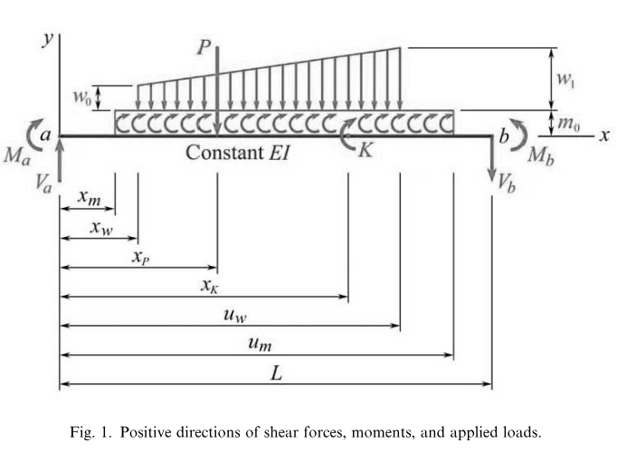
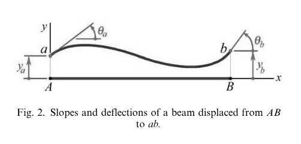

# BEAM SOLVER CORE - ANALYSIS MANUAL

## Introduction
TBD...

## Sign Convention
_All details below have been excerpted from a paper by I.C.Jong (link: https://icjong.hosted.uark.edu/docu/09.ijee.paper.pdf)_

### Forces and Moments
* A shear force is positive if it acts upward on the left (or downward on the right) face of the beam
element (e.g., Va at the left end _a_, and Vb at the right end _b_ in Fig. 1).
* At the ends of the beam, a moment is positive if it tends to cause compression in the top fiber of the
  beam (e.g., Ma at the left end _a_, and Mb at the right end _b_ in Fig. 1)
* If not at ends of the beam, a moment is positive if it tends to cause compression in the top fiber of
  the beam just to the right of the position where it acts (e.g., the concentrated moment K
  and the uniformly distributed moment with intensity m0 in Fig. 1)
* A concentrated force or a distributed force applied to the beam is positive if it is directed downward
  (e.g., the concentrated force P, the linearly distributed force with intensity w0 on the left side
  and intensity w1 on the right side in Fig. 1, where the distribution becomes uniform if w0 = w1 ).

### Deflections and Slopes
* A positive slope is a counterclockwise angular displacement (e.g., $\theta$a and $\theta$b in Fig. 2).
* A positive deflection is an upward linear displacement (e.g., *y*a and *y*b in Fig. 2)

